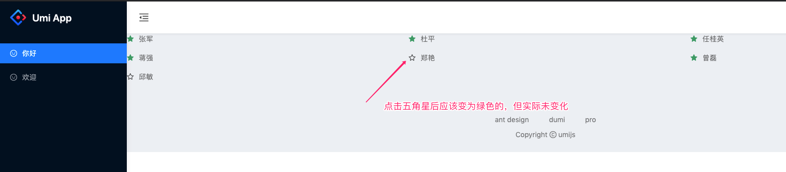

### Bug 复现 demo
[@umijs/plugin-model](https://github.com/umijs/plugins/blob/master/packages/plugin-model/src/index.ts) 在更新完数据后不会重新 render

#### 问题

组件订阅某个 model 中的数据，当该 model 中的数据更新后未 rerender 组件

比如下面的示例  

当鼠标点击五角星的时候应该由空心变为实心才对，但是实际上并没有变化



#### 核心代码块

模型 `models/home`

``` ts
import { useState, useEffect } from 'react';
import { useRequest } from 'umi';
import { query } from '@/services/api';
import { IFocusCustomer } from '@/types';

export default () => {
  const [focusUsers, setFocusUsers] = useState<IFocusCustomer[]>([]);
  const { data } = useRequest(query);
  useEffect(() => {
    setFocusUsers(data);
  }, [data]);
  return { focusUsers, setFocusUsers };
};

```

页面 `pages/index.tsx`

``` tsx
const UserItem = ({ id, name, isActive }) => {
  // @ts-ignore
  const { focusUsers, setFocusUsers } = useModel('home', (m) =>
    pick(m, 'focusUsers', 'setFocusUsers'),
  );
  // 点击五角星的逻辑
  const onClick = (status: string) => {
    const result = focusUsers.map((user: IFocusCustomer) => {
      if (user.id === id) {
        user.isActive = status !== 'active';
      }
      return user;
    });
    // 更新 model 中的数据
    setFocusUsers(result);
  };
  return (
    <>
      {isActive ? (
        <ActiveStarIcon onClick={() => onClick('active')} />
      ) : (
        <UnActiveStarIcon onClick={() => onClick('unActive')} />
      )}
      <Link to="" style={{ color: 'rgba(0, 0, 0, 0.5)' }}>
        {name}
      </Link>
    </>
  );
};

export default () => {
  // @ts-ignore
  const { focusUsers } = useModel('home', (m) => pick(m, 'focusUsers'));
  return (
    <List
      dataSource={focusUsers}
      renderItem={(item: IFocusCustomer) => (
        <List.Item>
          <UserItem id={item.id} name={item.customerName} isActive={item.isActive} />
        </List.Item>
      )}
    />
  );
};

```

#### 如何启动

```
$ git clone https://github.com/phobal/useModel-demo
$ cd useModel-demo
$ yarn
$ yarn start
```
当页面启动后，在浏览器中打开该项目，进入后页面中会出现一个列表，如【问题】中的图片所示  
1、当点击空心五角星时该五角星变为实心的五角星  
2、当点击实心的五角星时改五角星变为空心的五角星 

现在的问题是并没有变化。

